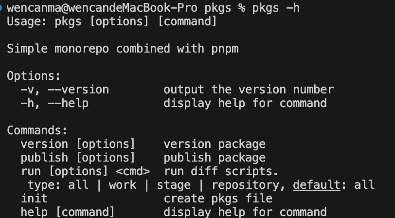

# 命令

## version
描述：版本升级
```bash
pkgs version -h

Usage: pkgs version [options]

version package

Options:
  # 同步模式 | 对比模式，默认是同步模式
  --mode <type>            sync | diff 
  # commit 的 message，默认’chore: version %s‘，%s是内部升级的包版本号
  -m, --message <message>  commit message 
  # 版本升级后是否推送到远程仓库，默认是true
  --push                   git push 
  # 版本升级后是否不推送到远程仓库，默认是false
  --no-push                not git push
  -h, --help               display help for command
```
### 示例
```bash
pkgs version --mode=sync --message=’chore: version %s‘ --no-push=false 
```

## publish
描述：版本发布
```bash
pkgs publish -h

Usage: pkgs publish [options]

publish package

Options:
  # 同步模式 | 对比模式，默认是同步模式
  --mode <type>  sync | diff
  # 版本升级后是否推送到远程仓库，默认是true
  --push                   git push 
  # 版本升级后是否不推送到远程仓库，默认是false
  --no-push                not git push
  -h, --help     display help for command
```
### 示例
```bash
pkgs publish --mode=sync --no-push=false 
```
## run
描述：运行包命令
```bash
pkgs publish -h

Usage: pkgs run [options] <cmd>

run diff scripts.
 type: all | work | stage | repository, default: all

Options:
  # 基于 git 仓库对影响的包运行命令，分别对应全部 | 工作区 | 暂存区 | 版本区，默认全部
  --type <type>  all | work | stage | repository
  # 同步模式 | 对比模式，默认是同步模式
  --mode <type>  sync | diff
  -h, --help     display help for command
```
### 示例
```bash
pkgs run --type=all --mode=sync 
```

## init
描述：创建项目
```bash
pkgs init -h

Usage: pkgs init [options]

create pkgs file

Options:
  -h, --help  display help for command
```
### 示例
```bash
pkgs init
```