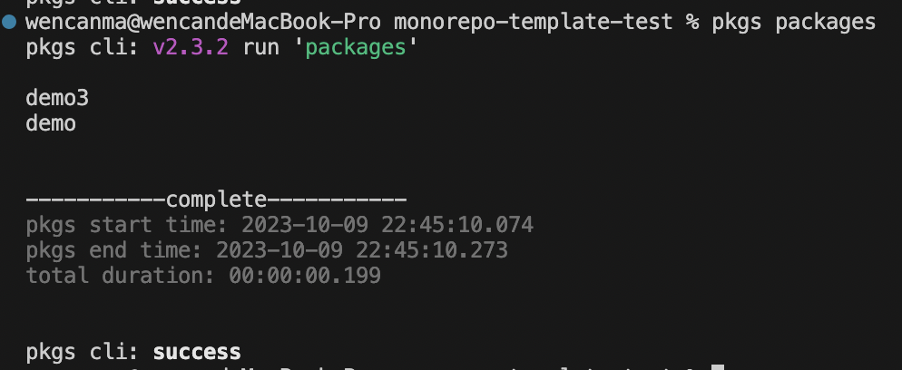

# 插件

## 简介
pkgs 支持插件化，通过配置文件 plugins 引入，支持函数、路径、模块名

[插件声明类型](/config/#类型-1)

插件格式基于 `commander` 封装，插件 action 方法会接受 context 与 插件定义的命令参数

## 实现插件
下列例子实现一个插件，返回工作区所有的包（包括间接影响的包），并基于依赖顺序打印到命令行上

### 实现过程
默认导出一个插件函数
```ts
import type { PluginData } from '@abmao/pkgs'

// ./plugin.ts
export default function createPackagesPlugin(): PluginData {
  return {
    id: 'packages',
    command: 'packages',
    description: 'get work packages',
    action: commandPackages,
  }
}
```
接收 context 做操作
```ts
import type { Context } from '@abmao/pkgs'

// ./plugin.ts
export async function parsecCommandPackages(context: Context): Promise<string[]> {
  // 获取工作区包目录路径（包括间接影响
  const files = await context.fileStore.workDiffFile()
  // 通过扑排序返回，返回依赖顺序的包目录数组
  const packageDirList = context.contextAnalysisDiagram.getDirTopologicalSorting(files)

  const packageNameList = packageDirList
    // 包目录映射到对应的图表，拿到包名
    .map(dir => context.contextAnalysisDiagram.dirToAnalysisBlock(dir)?.name)
    .filter(name => name) as string[]
  return packageNameList
}

export async function commandPackages(context: Context): Promise<string[]> {
  // 接收命令
  const packageNameList = await parsecCommandPackages(context)
  // 序列化成字符串
  const logStr = packageNameList.reduce((previousValue, currentValue) => {
    return `${previousValue}\n${currentValue}`
  }, '')
  // 打印命令
  console.log(logStr)
  return packageNameList
}
```

```ts
// ./pkgs.config.ts
import { createPackagesPlugin } from './plugin.ts'

export default {
  plugins: [
    createPackagesPlugin,
  ],
}
```
运行命令
```bash
pkgs -h
```

```bash
pkgs packages
```



