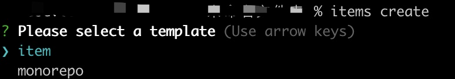

# 快速起步

## 安装

### 全局安装

::: code-group

  ```bash [npm]
  npm install @abmao/pkgs -g
  ```
  ```bash [yarn]
  yarn add @abmao/pkgs -g
  ```
  ```bash [pnpm]
  pnpm add @abmao/pkgs -g
  ```

:::

#### 使用
```bash
pkgs init // 创建项目
pkgs version // 升级包
pkgs publish // 发布包
```

### 项目安装

::: code-group

  ```bash [npm]
  npm install @abmao/pkgs
  ```
  ```bash [yarn]
  yarn add @abmao/pkgs
  ```
  ```bash [pnpm]
  pnpm add @abmao/pkgs
  ```

:::

#### 使用
在 package.json 的 scripts 定义命令
```json
{
  "scripts": {
    "release": "pkgs version && pkgs publish",
  }
}
```

代码调用
```js
import { commandVersion, commandPublish } from '@abmao/pkgs'
(async function () {
  await commandVersion()
  await commandPublish()
})()
```

## 模板
安装 [@abmao/items](https://github.com/hengshanMWC/items)，一键创建项目体验

::: code-group

  ```bash [npm]
  npm install @abmao/items -g
  ```
  ```bash [yarn]
  yarn add @abmao/items -g
  ```
  ```bash [pnpm]
  pnpm add @abmao/items -g
  ```

:::

```bash
items create [name]
```
